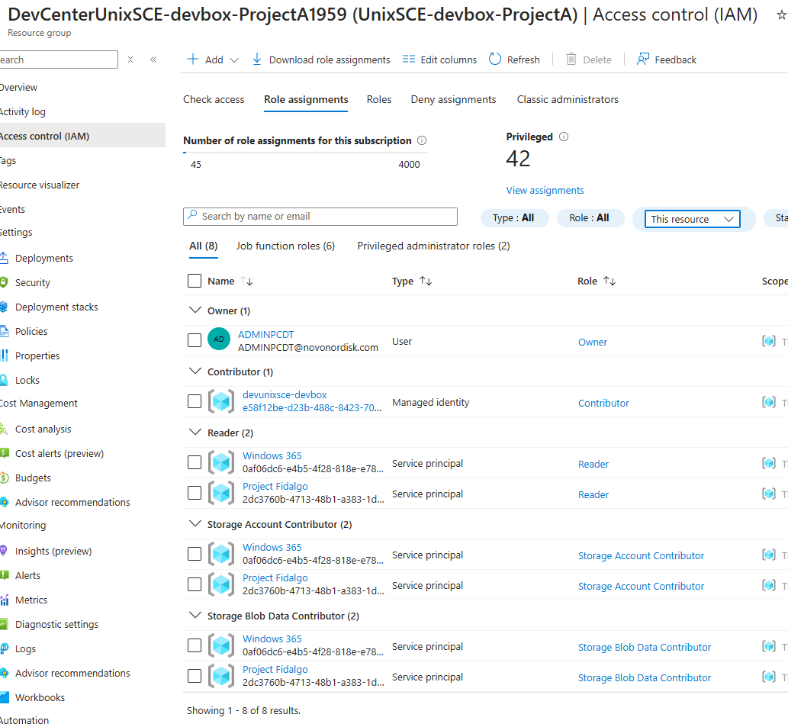

A test of Microsoft Dev Box


Process
Create base resource group
Grant Admin account owner on resource group to ease working on it
Create Dev Center
Create Project
    Project resource groups is created automatically with a Azure Compute Gallery in it.
    Grant access rights to the auto created resource group
    


## NEXT
- Image created today in PUB from ADO does not have link. Try to create a machine, then commit the code with the link, then see if machine gets updated.

## ADO
- Managed identity needs to have Basic license on ADO!!!
- Remove the ```.``` from ```.devcenter/catalog/image-definitions``` so it becomes ```devcenter/catalog/image-definitions``` for the sync of catalog to work.


## Thoughts
- It would be nice if image was validated before build, like it does when building an image from an Image Template. So we didn't have to wait until the service tries to store the image. 

## Next steps with the product group
- GitHub enterprise
- Azure DevOps and configuration files - Raw?
- ADO - remove ```.```,  tried ProjectA without dot and ProjectB with dot - got error on B   
    
    
- If I create a dev box pool on a project, I chose the image directly from the catalog I can hibernate, but if i chose it from the dev box definitions I cant. Why?

